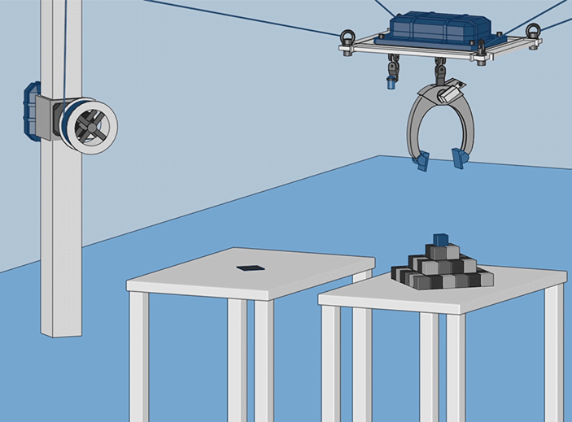

The Fae-bot is a suspended robot, using 4 cables and 4 winches in its standard configuration. By rolling and unrolling the cables in a calculated fashion, the central platform can be moved in a big 3D volume.

